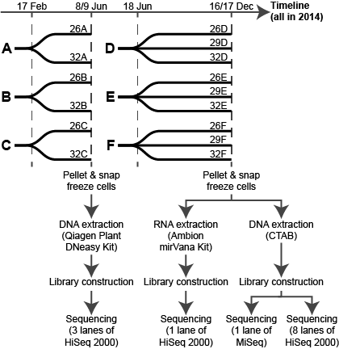

===============================================================================================
The role of DNA methylation in the dinoflagellate coral symbiont *Symbiodinium microadriaticum*
===============================================================================================

This repository contains the code and key intermediate files needed for the analysis of methylation and expression patterns of 15 *S. microadriaticum* samples (n = 6 at 26C, n = 3 at 29C, n = 6 at 32C).

Due to the gigabase-range *S. microadriaticum* genome, and the non-negligible methylation in CHG and CHH contexts, some of the intermediate files are in the gigabyte-range even after compression. This creates unnecessary bloat in this repository--I have chosen to exclude them. I'll describe how they were generated, though.

As with other repos, I have also gzipped large text files (``*.txt``, ``*.tsv``). Some of them may need to be decompressed before use--have a quick glance at the script that reads the file, if there's no ``.gz`` to be seen then yeah, please decompress the input file.

Methylation pipeline
--------------------
The methylation pipeline used in this project is available elsewhere at https://github.com/lyijin/working_with_dna_meth, which provides a fuller description (and theoretical considerations) of the pipeline used, and the scripts written to operate on Bismark's output.

Bismark ends by producing ``*.cov`` files, which were extracted from the corresponding deduplicated ``*.bam`` files.

Post-filtering, ``annotate_bismark_cov.py`` added per-position annotations for each methylated position, which I then ``gzip``ped to produce the ``*.cov.gz`` files you see at the root folder. For those who are interested in the analyses instead of the data filtering steps, these files are THE key intermediate files that get used in many other scripts to produce tables/graphs.

Brief description of folder contents
------------------------------------
Each folder described below has another README within the folder, which describes the figures plotted from the code within the nested subfolders.

1. ``custom_protocols`` contains non-standard experimental protocols.

2. ``descriptive_rnaseq`` analyses the RNA-seq data generated in this project.

3. ``descriptive_wgbs`` likewise, but for WGBS data.

4. ``filter_meth_pos_CX`` talks about the filtering of methylated postiions.

5. ``mapping_against_non_symb`` describes our troubleshooting of the low mapping rates by mapping against a suite of other genomes.

6. ``raw_data`` contains... raw data used in this project.

7. ``rnaseq`` has the scripts used to carry out ``kallisto``/``sleuth`` analyses.

8. ``wgbs_vs_rnaseq`` compares WGBS vs. RNA-seq data.

Experimental setup
------------------

(yes, the data is old enough to go to school at the time of writing.)

Line counts of files in ``./*.cov.gz``
--------------------------------------
Number of lines == number of methylated positions in these files. ::

    lyijin@mirrordin:/mnt/c/Yi/github/smic_dna_meth$ wc -l *.cov
         6748 26A.cov
         6748 26B.cov
         6748 26C.cov
         6748 26D.cov
         6748 26E.cov
         6748 26F.cov
         6748 29D.cov
         6748 29E.cov
         6748 29F.cov
         6748 32A.cov
         6748 32B.cov
         6748 32C.cov
         6748 32D.cov
         6748 32E.cov
         6748 32F.cov
        86666 all.bona_fide_meth_pos.annot.c20.chg.cov
       213296 all.bona_fide_meth_pos.annot.c20.chh.cov
       478717 all.bona_fide_meth_pos.annot.c20.cov
       178755 all.bona_fide_meth_pos.annot.c20.cpg.cov
         6748 all.cov

Further explanation for this is provided in ``filter_meth_pos_CX/``.
